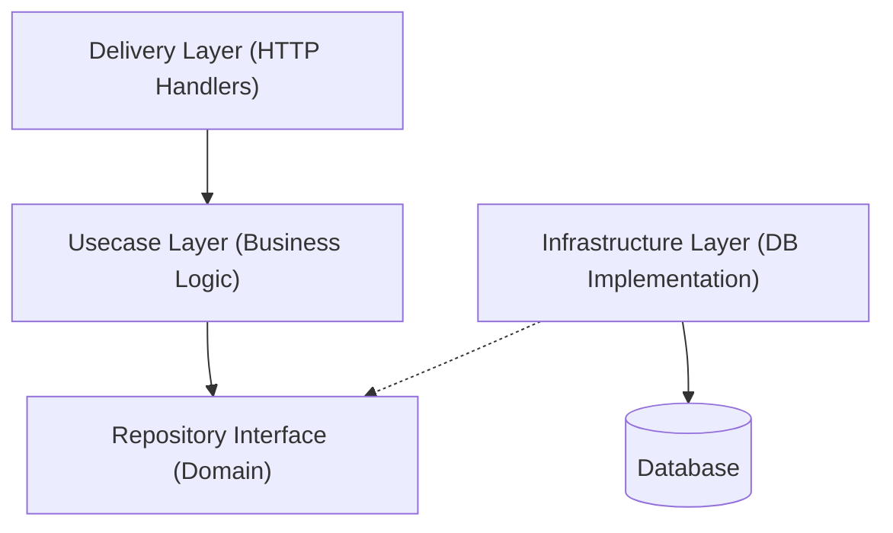

# Admin Pro Golang 项目文档

这是一个基于 **Clean Architecture (整洁架构)** 设计的现代 Golang 后端项目。本项目重构自 `admin-pro`，旨在提供高性能、可维护、易扩展的企业级后台管理系统后端。

## 1. 项目简介

本项目采用 Go 语言开发，使用了 `Gin` 作为 Web 框架，`GORM` 作为 ORM 框架，并严格遵循整洁架构原则，将业务逻辑与外部依赖（如数据库、HTTP 框架）解耦。

### 技术栈
- **语言**: Go (Golang) 1.21+
- **Web 框架**: Gin v1.11.0
- **数据库 ORM**: GORM v1.31.1 (MySQL)
- **鉴权**: JWT (JSON Web Token) v5.3.0
- **密码加密**: Bcrypt
- **文档**: Swagger v1.16.6
- **配置**: Viper v1.21.0 (支持环境变量)
- **日志**: 结构化日志
- **系统监控**: gopsutil v3.24.5

### 最近改进
- ✅ 支持环境变量配置敏感信息
- ✅ 优化错误处理和错误包装
- ✅ 添加结构化日志和请求日志中间件
- ✅ 优化数据库连接池配置
- ✅ 改进 CORS 安全配置
- ✅ 添加 Docker 支持
- ✅ 添加单元测试框架
- ✅ 简化项目目录结构

## 2. 架构设计 (Architecture)

本项目采用了 **Clean Architecture**，将代码分为四层。这种架构的核心思想是**依赖倒置**：内层（业务逻辑）不依赖外层（技术实现），外层依赖内层。



### 2.1 目录结构说明

```
admin-pro-golang/
├── cmd/                      # [入口] 应用程序入口
│   └── app/
│       └── main.go           # 程序启动入口，负责依赖注入和路由注册
├── internal/                 # [内部包] 核心业务逻辑
│   ├── config/               # [配置] 配置结构体定义
│   ├── delivery/             # [交付层] 负责处理 HTTP 请求
│   │   └── http/
│   │       ├── v1/           # API v1 版本处理器
│   │       └── middleware/   # 中间件 (JWT, CORS 等)
│   ├── domain/               # [领域层] 核心业务定义
│   │   ├── entity/           # 实体定义 (数据库表映射)
│   │   └── repository/       # 仓库接口定义
│   ├── infrastructure/       # [基础设施层] 技术实现
│   │   └── persistence/      # 数据持久化实现
│   │       ├── db.go         # 数据库初始化
│   │       └── mysql/        # MySQL/GORM 实现
│   └── usecase/              # [用例层] 业务逻辑实现
├── pkg/                      # [公共包] 通用工具库
│   ├── errors/               # 错误定义和包装
│   ├── logger/               # 结构化日志
│   ├── middleware/           # 请求日志中间件
│   ├── response/             # 统一响应格式
│   ├── testutil/             # 测试辅助工具
│   └── utils/                # 工具函数 (JWT, Crypto 等)
├── docs/                     # Swagger API 文档
├── config.yaml               # 配置文件
├── docker-compose.yml        # Docker Compose 配置
├── Dockerfile               # Docker 镜像构建
├── Makefile                 # 构建和测试命令
├── go.mod                   # Go 模块定义
└── go.sum                   # 依赖锁定
```

### 2.2 各层详细解释

1.  **Domain Layer (领域层)**: `internal/domain`
    -   这是整个系统的**核心**。它定义了"我们有什么"（Entity 实体）以及"我们要对数据做什么"（Repository 接口）。
    -   **Entity**: 比如 `User` 结构体，对应数据库里的 `sys_user_tbl` 表。
    -   **Repository Interface**: 比如 `UserRepository` 接口，定义了 `GetUser(id)` 方法，但**不写**具体怎么连数据库查。

2.  **Usecase Layer (业务逻辑层)**: `internal/usecase`
    -   这里写具体的**业务流程**。比如"用户登录"：1. 查用户是否存在，2. 校验密码，3. 生成 Token。
    -   它只依赖 `Repository 接口`，不关心数据到底存在哪里。

3.  **Infrastructure Layer (基础设施层)**: `internal/infrastructure`
    -   这里实现了 `Domain` 层定义的接口。
    -   比如 `mysql/user_repo.go`，它使用 `GORM` 连接 MySQL 执行 SQL。

4.  **Delivery Layer (交付层)**: `internal/delivery`
    -   这里是**对外窗口**。对于 Web 项目就是 HTTP API。
    -   `Handler` 负责接收 HTTP 请求，解析参数，调用 `Usecase`，返回 JSON。

## 3. 快速开始

### 3.1 环境要求
- Go 1.21+
- MySQL 5.7+ 或 Docker

### 3.2 配置

创建 `.env` 文件（参考 `.env.example`）：

```bash
# Server Configuration
SERVER_PORT=:8080
SERVER_MODE=debug

# Database Configuration
DB_HOST=127.0.0.1
DB_PORT=3306
DB_USER=root
DB_PASSWORD=your_secure_password_here
DB_NAME=adminpro

# JWT Configuration
JWT_SECRET=your_jwt_secret_key_change_this_in_production
JWT_EXPIRE=24
```

### 3.3 运行步骤

#### 方式一：直接运行

1. **配置数据库**: 修改 `backend/config.yaml` 或使用环境变量
2. **进入目录**: `cd backend`
3. **下载依赖**: `go mod tidy`
4. **运行程序**: `go run cmd/app/main.go`
   - 或者使用 Makefile: `make run`
   - 或者编译后运行: `make build && ./bin/admin-pro`

#### 方式二：使用 Docker

```bash
# 启动所有服务（包括 MySQL）
docker-compose up -d

# 查看日志
docker-compose logs -f backend

# 停止服务
docker-compose down
```

### 3.4 测试

```bash
# 运行所有测试
make test

# 运行测试并生成覆盖率报告
make test-coverage
```

### 3.5 访问接口
- API 文档: `http://localhost:8080/swagger/index.html`
- 健康检查: `http://localhost:8080/health`

## 4. 关键代码流程解析 (以用户列表为例)

1.  **Browser**: 发送 `GET /api/v1/user/list` 请求。
2.  **main.go**: 初始化依赖链：`MySQL Repo` -> `Usecase` -> `Handler`。
3.  **Handler (`user_handler.go`)**: 接收请求，解析分页参数，调用 `usecase.GetUserList()`。
4.  **Usecase (`user_usecase.go`)**: 接收调用，执行业务逻辑（如判断权限），调用 `repo.GetUsers()`。
5.  **Repository (`user_repo.go`)**: 使用 `GORM` 执行 `SELECT * FROM sys_user_tbl ...`，返回数据。
6.  **Handler**: 将结果包装成统一 JSON 格式返回给前端。

## 5. 功能模块状态

- [x] **认证授权**: 登录, JWT Token, 权限拦截
- [x] **用户管理**: 增删改查, 角色分配
- [x] **系统管理**: 部门, 岗位, 字典, 参数, 公告, 日志
- [x] **系统监控**: 在线用户, 服务器资源监控
- [x] **定时任务**: 任务管理, 执行日志
- [x] **开发工具**: 代码生成

---
**学习建议**: 对于 Golang 新手，建议从 `internal/domain/entity` 开始看起，理解数据库模型；然后看 `internal/delivery/http/v1` 理解接口定义；最后看 `internal/usecase` 理解业务串联。
